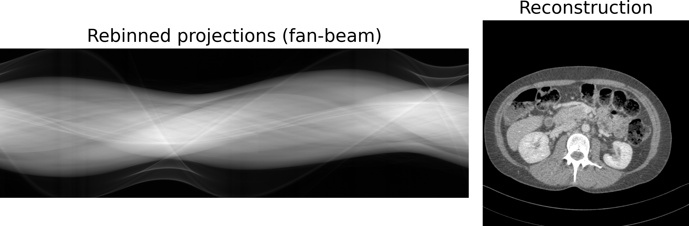

.. image:: https://img.shields.io/badge/License-Apache%202.0-blue.svg
    :target: https://opensource.org/licenses/Apache-2.0
.. image:: https://img.shields.io/badge/arXiv-2211.01111-f7dda4.svg
    :target: https://arxiv.org/abs/2211.01111

=================================================================================================================
Helix2Fan: Helical to fan-beam CT geometry rebinning and differentiable reconstruction of DICOM-CT-PD projections
=================================================================================================================

This repository provides code to load raw helical DICOM-CT-PD CT projections and
rebin them to flat detector fan-beam geometry. We follow the algorithm
of `Noo et al. <https://doi.org/10.1088/0031-9155/44/2/019>`__ to rebin projections acquired on a
helical CT trajectory to a circular trajectory. This enables CT reconstructing using conventional reconstruction
frameworks and even differentiable filtered back projection (FBP) operators.
In addition to the rebinning framework we provide code to reconstruct the processed projections using a differentiable
FBP operator from the `torch-radon <https://github.com/matteo-ronchetti/torch-radon>`__
framework. This differentiable operator allows propagating a loss metric, calculated on the reconstructed image,
back to the projection data. It, therefore, enables intervening into the reconstruction pipeline at different stages
with, e.g., neural networks.

In our associated paper `On the benefit of dual-domain denoising in a self-supervised low-dose CT setting <https://arxiv.org/pdf/2211.01111.pdf>`__
we use this framework to render medical low-dose CT data acquired on a helical trajectory suitable for end-to-end
reconstruction and denoising in both projection and image domain using neural networks. Please refer to our
`arXiv <https://arxiv.org/pdf/2211.01111.pdf>`__ publication if you find our code useful.

Projection data (DICOM-CT-PD):
~~~~~~~~~~~~~~~~~~~~~~~~~~~~~~

Our data loader supports the standardized `DICOM-CT-PD format <https://doi.org/10.1118/1.4935406>`__ for
loading and preparing the projection data and geometry information for rebinning and CT reconstruction.
The largest public low-dose CT image and projection data set
`LDCT-and-Projection-data <https://doi.org/10.1002/mp.14594>`__ provides projection data of more than 100
abdomen/chest/head CT scans in the DICOM-CT-PD format. Please download projection data
from `their repository <https://wiki.cancerimagingarchive.net/pages/viewpage.action?pageId=52758026>`__ to run
the rebinning in this framework.

Setup rebinning:
~~~~~~~~~~~~~~~~

1. Create and activate a python environment (python>=3.7).
2. Install `Torch <https://pytorch.org/get-started/locally/>`__.
3. Download the DICOM-CT-PD projection data from `TCIA <https://wiki.cancerimagingarchive.net/pages/viewpage.action?pageId=52758026>`__.
4. Run the rebinning code:

.. code:: bash

   python main.py --path_dicom '/path/to/DICOM-CT-PD/data/folder'

5. Find the rebinned data in the out folder (default).

Setup differentiable reconstruction:
~~~~~~~~~~~~~~~~~~~~~~~~~~~~~~~~~~~~

If you want to run the reconstruction script you additionally need to install torch-radon

1. Download `torch-radon <https://github.com/matteo-ronchetti/torch-radon>`__

.. code:: bash

   git clone https://github.com/matteo-ronchetti/torch-radon.git
   cd torch-radon

2. The current torch-radon repository uses some outdated PyTorch functions. You can use the torch-radon_fix.patch in the torch-radon_fix folder of the helix2fan repository to fix this problem:

.. code:: bash

   git apply path/to/helix2fan/torch-radon_fix/torch-radon_fix.patch

3. Install torch-radon

.. code:: bash

   python setup.py install

4. Run the reconstruction code using the rebinned projections .tif:

.. code:: bash

   python reco_example_fan_beam.py --path_proj '/path/to/fan-beam/projections.tif'

5. Find the reconstructed CT images in the out folder (default).

Example scripts:
~~~~~~~~~~~~~~~~
-  Please use the main.py for projection loading and rebinning.
-  Please use reco_example_fan_beam.py to reconstruct the final CT image from the rebinned projection data.

Some tips:
~~~~~~~~~~
-  Make sure you rebin enough projections acquired on the helical trajectory to cover all 360deg of the volume
   slices you are interested in.
-  The reconstructed volume will contain streaks and artifacts in slices where you did not use projections from
   all 360deg
-  The start and end index of the helical projections that are loaded and used can be chosen with the arguments
   --idx_proj_start and --idx_proj_stop

.. code:: bash

   python main.py --path_dicom '/path/to/DICOM-CT-PD/data/folder' --idx_proj_start 12000 --idx_proj_stop 16000

-  Rebinning all available helical projections from TCIA abdomen scans can take quite some time. So, make sure you
   choose start and stop index according to the CT slices you are interested in.
-  Other rebinning and reconstruction arguments are listed in the main.py and reco_example_fan_beam.py scripts and
   can be set via command line or code.

Disclaimer:
~~~~~~~~~~~
Right now the helical to fan beam geometry rebinning does not properly correct for the flying focal spot (FFS)
acquisition. All required geometry parameters are correctly read out from the DICOM-CT-PD raw data
(--dangles, --dz, --drho). However, torch-radon currently does not support shifting the source
position relative to the detector which would be required to accurately correct for FFS. The soon released
revised version of torch-radon will be capable to handle such shifts. We will then adapt the helix2fan code accordingly.
For now please use the example scripts if you want to do differentiable FBP. Alternatively, consider the --dangles, --dz, --drho
parameters in your custom reconstruction code to achieve reconstruction qualities even closer to the vendor's scanner
reconstruction software (even without proper FFS correction is the reconstruction quality reasonable).
The geometry of the different FFS protocols are defined in the
`DICOM-CT-PD User Manual <https://wiki.cancerimagingarchive.net/pages/viewpage.action?pageId=52758026>`__.

Citation:
~~~~~~~~~

If you find our code useful, please cite our work

::

   @article{wagner2022dual,
     title={On the benefit of dual-domain denoising in a self-supervised low-dose CT setting},
     author={Wagner, Fabian and Thies, Mareike and Pfaff, Laura and Aust, Oliver and Pechmann, Sabrina and Maul, Noah and Rohleder, Maximilian and Gu, Mingxuan and Utz, Jonas and Denzinger, Felix and Maier, Andreas},
     journal={arXiv preprint arXiv:2211.01111},
     year={2022},
     doi={https://doi.org/10.48550/arXiv.2211.01111}
   }

Troubleshooting
~~~~~~~~~~~~~~~
